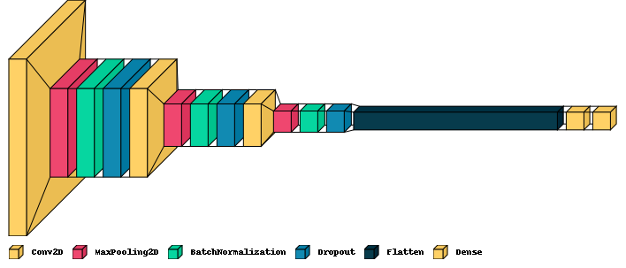
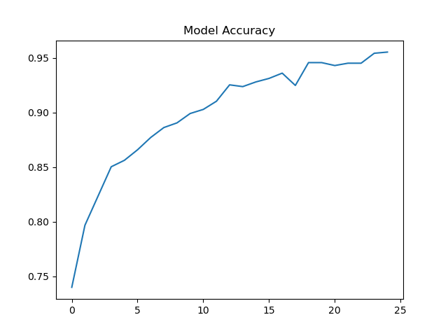
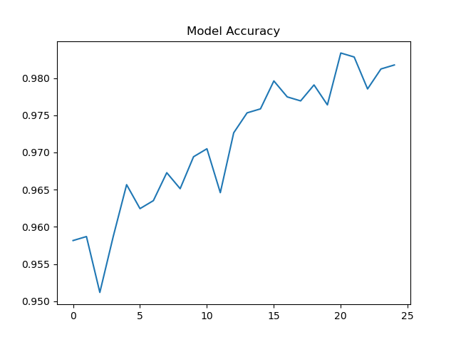
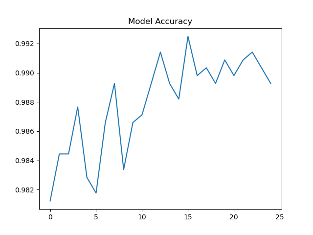
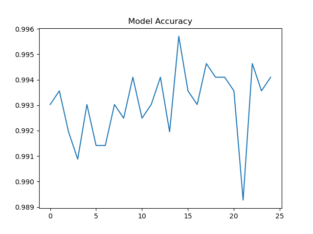
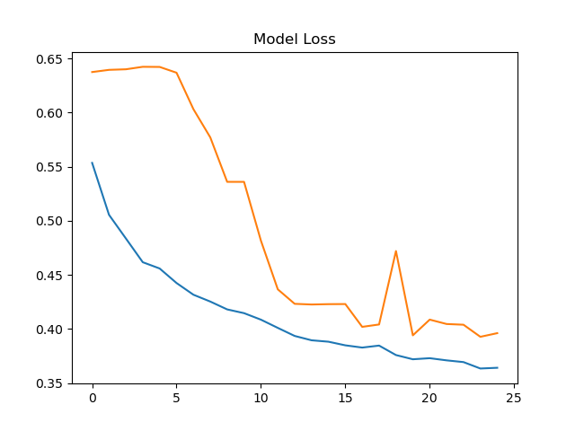
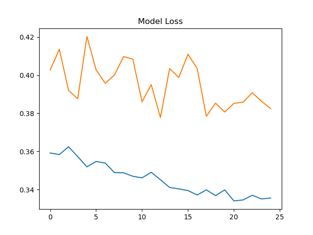
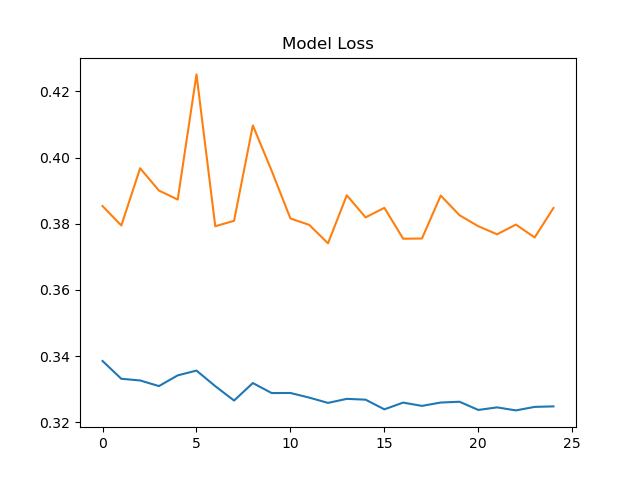
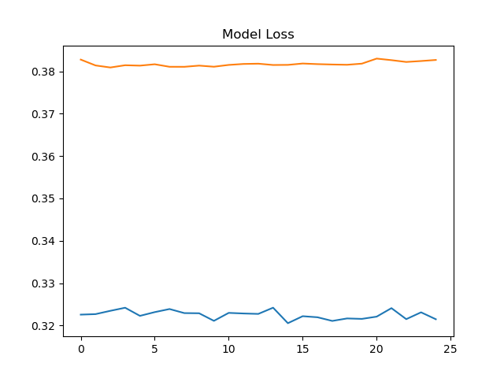
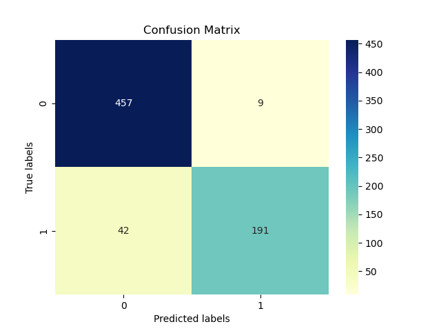

# COVID-19 Classification Using Convolutional Neural Networks

## Problem Statement
COVID-19 has been a rapidly growing pandemic in the past two years. While the strain has broken, there are still many cases emerging worldwide every day. As more and more data from medical labs are flooding the internet, we aim to create an AI-driven model that accurately classifies cases using only chest x-ray images. For this purpose, we used a Convolutional Neural Networks (CNN).

## Dataset
The dataset used for this project is COVID-QU-Ex under the license of Qatar University. The dataset contains 11,956 COVID-19 and 10,701 Normal chest x-rays.

<a href="https://www.kaggle.com/datasets/anasmohammedtahir/covidqu" target="_blank">[Dataset Link]</a>

## Dataset Pre-Processing

The dataset came pre-cleaned so we did not have to clean any outlying samples. We pre-processed the images in the following manner.

- Resize to 50x50 (This was done only to ensure model gets to work quickly. This is not the ideal size to work with diagnostic images. Use at least 200x200). This helps in lessening the computations.
- Convert to NumPy arrays. This helps in dealing with data intuitively.
- Regularize by mapping colour channels to [0, 1]. This optimizes model performance.
- Cap the samples at an upper bound. This avoids bias in a model.

## Model Selection

For the purpose of this project, our focus was on image processing and classification. This is why we used CNNs instead of traditional neural networks. We observed that CNNs give vastly better performance on image data, especially in the context of medical diagnosis.

## Model Architecture


## Model Parameters

```
Convolutional2D 		    [filters=32, kernel_size=3, activation=”ReLU”]
MaxPool 			    [pool_size=(2,2)]
BatchNormalization 	            [default parameters]
Dropout 			    [rate=20%]

Convolutional2D 		    [filters=32, kernel_size=3, activation=”ReLU”]
MaxPool 			    [pool_size=(2,2)]
BatchNormalization 	            [default parameters]
Dropout 			    [rate=20%]

Convolutional2D 		    [filters=64, kernel_size=3, activation=”ReLU”]
MaxPool 			    [pool_size=(2,2)]
BatchNormalization 	            [default parameters]
Dropout 			    [rate=20%]

Flatten 			    [default parameters]
Dense (Hidden) 		            [nodes=128, activation=’ReLU’]
Dense (Output) 		            [nodes=2, activation=’SoftMax’]
```

## Train-Test-Validate Split

For this dataset, we split the dataset into three segments Train-Test-Validation. For the training of the model, we only used the training segment of the data. For further testing and validation, the test-validation split was used. This allowed our model to train on a small sample and generalize to a larger dataset.

## Limitations

We had to use 50x50 images to avoid very long training times. If there was access to higher power computation devices, the accuracy could be further fine-tuned.


## Results

### Accuracy

#### First 25 Epochs

#### Second 25 Epochs

#### Third 25 Epochs

#### Fourth 25 Epochs


### Loss
#### First 25 Epochs

#### Second 25 Epochs

#### Third 25 Epochs

#### Fourth 25 Epochs


### Confusion Matrix


## Final Words

Our model achieved a peak accuracy of 99.4% on training data and 93% on validation and testing data. In our observations, if the model were to be trained more, it would’ve reached further accuracy, however, in our use case 99.4% seemed reasonable.

## How to run on your system?

- First, download the datset from the given link.
- Copy the dataset local project directory.
- Clone the repository and update the dataset path in ```src/constants.py```
- Install the required dependencies such as ```keras, matplotlib, and visualkeras```.
- Run ```src/app.py``` and a GUI window will open.

## Future Work

I am hoping to explore this further in a more powerful environment using 200x200 pictures instead of the 50x50. Furthermore, the dataset contains Non-COVID samples as well which were not included in our training. I aim to explore the COVID and Non-COVID classification domain as well.